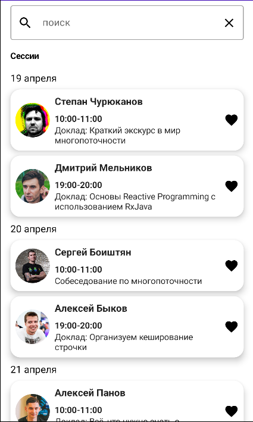
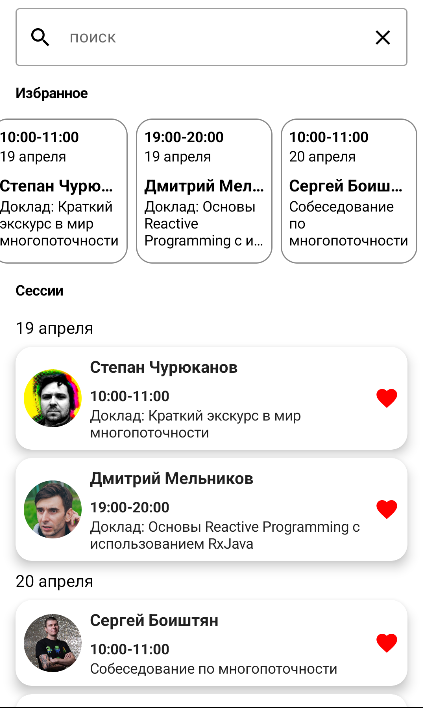
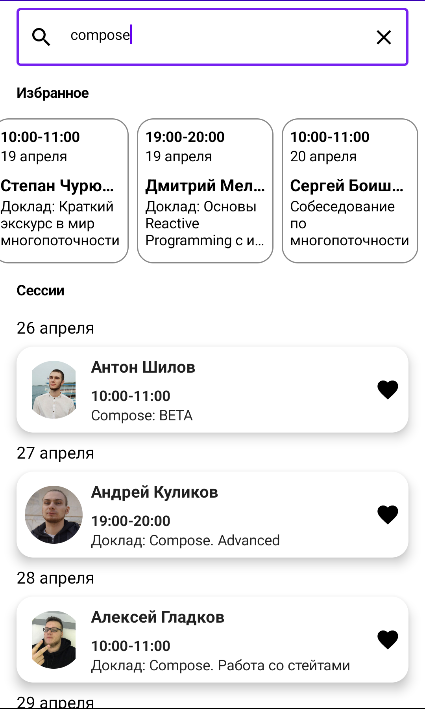

# ComposeApp
  

# Jetpack Compose application
Inspirated from to [MobileDeveloper](https://www.youtube.com/c/MobileDeveloper)

## Info
* MVVM design pattern
* Kotlin coroutines
* Retrofit2
* Coil
* Compose

## Description
[Task description](https://docs.google.com/document/d/1XiNfo4pGc5VT1e-88bU7JB23IxE3QAmVOovgFT7FSwA/)

## Resume
[Download apk](https://github.com/Havriiash/ComposeApp/raw/main/apk/composeapp.apk)

